# Lattice spin models: phase transitions on the GPU

Monte Carlo simulations of the **Ising, Potts, XY and Heisenberg** models in one, two and three dimensions,
with CPU (Numba) and GPU (CUDA) engines, cluster algorithms, parallel tempering, finite-size-scaling
analysis, and a pipeline that turns the simulations into **videos of phase transitions**.

<p align="center">
  <a href="https://github.com/EstebanCardenas2001/Ising-model/releases/download/v0.2.0/compare_2d_symmetries.mp4">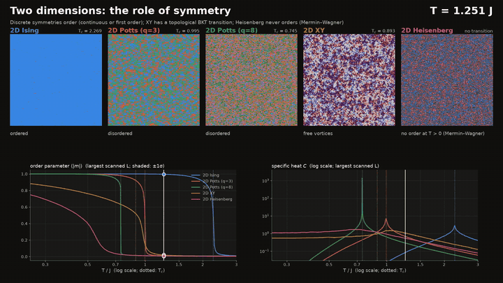</a><br>
  <em>Five 2D models cooled together. The discrete models order, the XY model goes through a
  Berezinskii–Kosterlitz–Thouless transition, and the Heisenberg model never orders (Mermin–Wagner).</em>
</p>

## Videos

All videos are 1080p, 30 fps H.264, made with this code on one NVIDIA T4. **Click a thumbnail to
play or download the full video** (they are attached to the
[v0.2.0 release](https://github.com/EstebanCardenas2001/Ising-model/releases/tag/v0.2.0)).

### One model at a time (50 s each)

A large lattice (960×960 in 2D, a 240³ lattice shown as a slice in 3D, or a 960-site chain as a
space-time diagram in 1D) is cooled slowly through its transition. Every frame is an equilibrium
configuration. Next to it, equilibrium curves for four system sizes show the order parameter,
susceptibility, specific heat, Binder cumulant and energy (the XY video shows the spin stiffness
and a zoom on vortices instead). A cursor marks the current temperature, a white dot tracks the live
lattice, and the energy histogram is reweighted to the current temperature. A caption names the phase.

<table>
<tr><td width="33%" valign="top"><a href="https://github.com/EstebanCardenas2001/Ising-model/releases/download/v0.2.0/ising1d.mp4">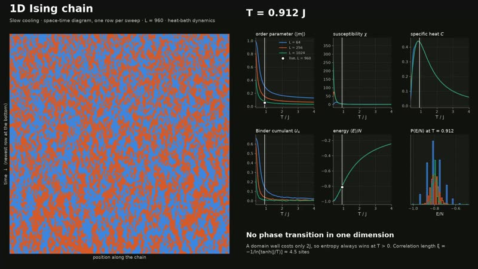</a><br><b>1D Ising: no transition</b></td><td width="33%" valign="top"><a href="https://github.com/EstebanCardenas2001/Ising-model/releases/download/v0.2.0/ising2d.mp4">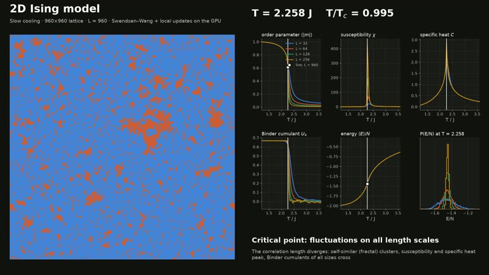</a><br><b>2D Ising: Onsager transition</b></td><td width="33%" valign="top"><a href="https://github.com/EstebanCardenas2001/Ising-model/releases/download/v0.2.0/ising3d.mp4">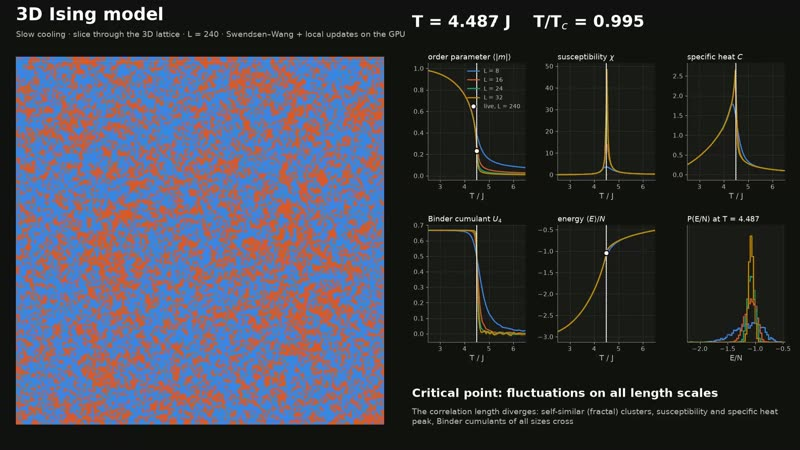</a><br><b>3D Ising</b></td></tr>
<tr><td width="33%" valign="top"><a href="https://github.com/EstebanCardenas2001/Ising-model/releases/download/v0.2.0/potts3_2d.mp4">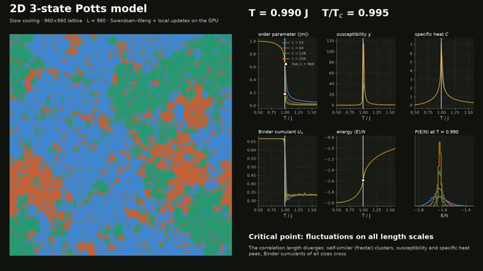</a><br><b>2D 3-state Potts: continuous</b></td><td width="33%" valign="top"><a href="https://github.com/EstebanCardenas2001/Ising-model/releases/download/v0.2.0/potts8_2d.mp4">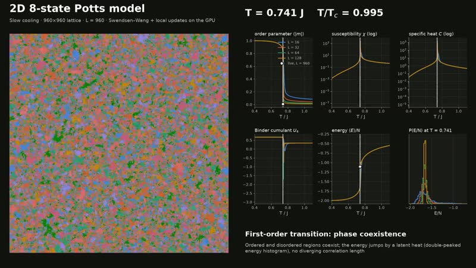</a><br><b>2D 8-state Potts: first order</b></td><td width="33%" valign="top"><a href="https://github.com/EstebanCardenas2001/Ising-model/releases/download/v0.2.0/xy2d.mp4">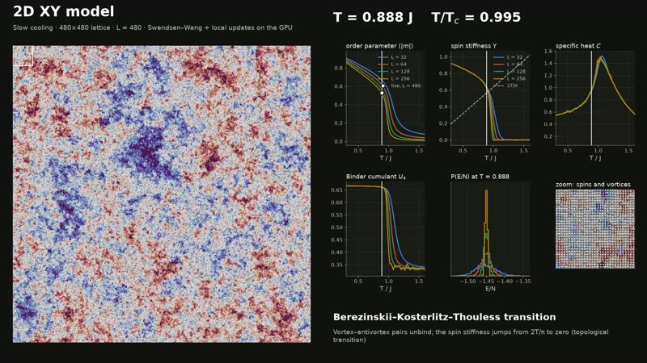</a><br><b>2D XY: BKT transition, vortices</b></td></tr>
<tr><td width="33%" valign="top"><a href="https://github.com/EstebanCardenas2001/Ising-model/releases/download/v0.2.0/xy3d.mp4">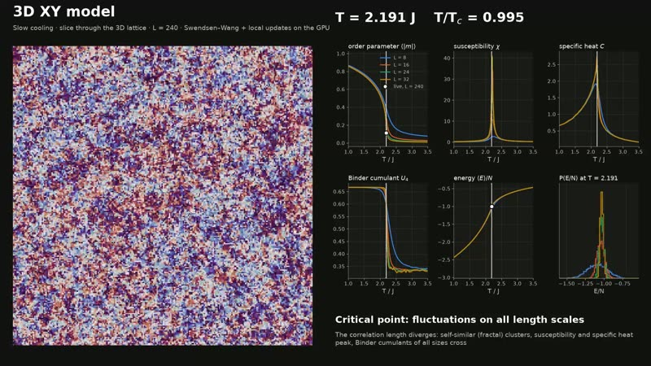</a><br><b>3D XY</b></td><td width="33%" valign="top"><a href="https://github.com/EstebanCardenas2001/Ising-model/releases/download/v0.2.0/heis2d.mp4">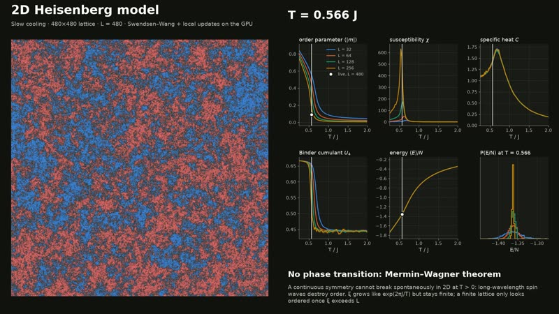</a><br><b>2D Heisenberg: Mermin–Wagner, no order</b></td><td width="33%" valign="top"><a href="https://github.com/EstebanCardenas2001/Ising-model/releases/download/v0.2.0/heis3d.mp4">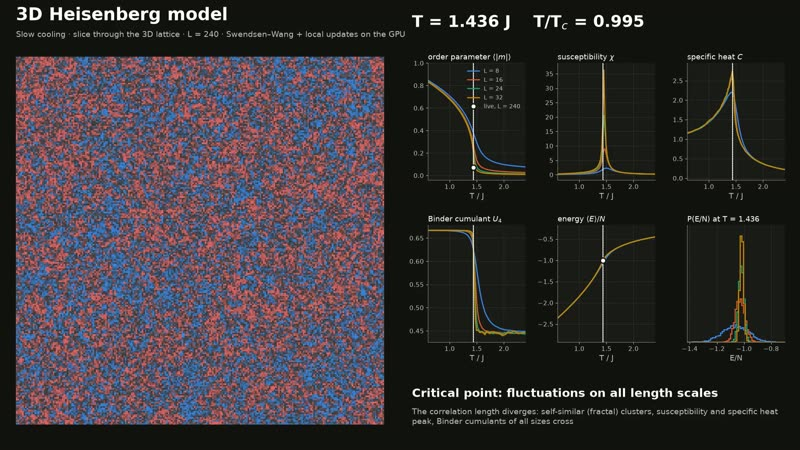</a><br><b>3D Heisenberg</b></td></tr>
</table>

<p align="center">
  <a href="https://github.com/EstebanCardenas2001/Ising-model/releases/download/v0.2.0/ising2d.mp4">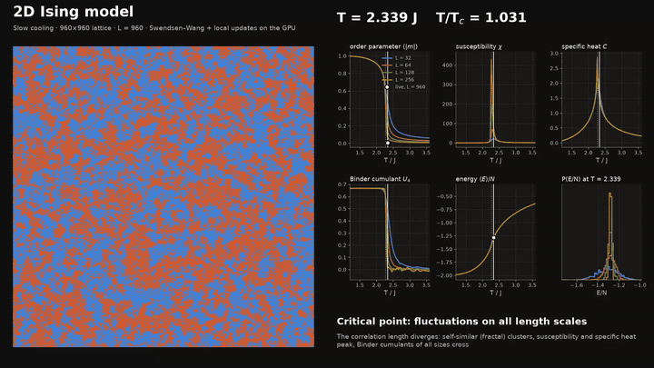</a><br>
  <em>2D Ising model crossing T<sub>c</sub>: fractal critical clusters, the susceptibility peak,
  and the Binder cumulants of all sizes crossing.</em>
</p>

### Comparisons (50 s each)

The same temperature, applied to different dimensions and symmetries.

<table>
<tr><td width="33%" valign="top"><a href="https://github.com/EstebanCardenas2001/Ising-model/releases/download/v0.2.0/compare_ising_dimensions.mp4">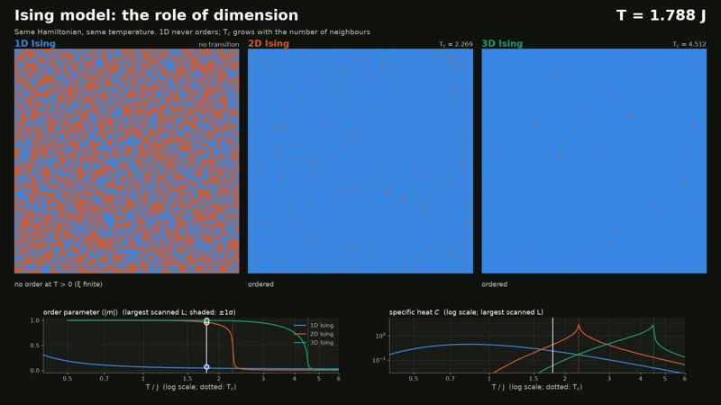</a><br><b>Ising in 1D, 2D, 3D</b></td><td width="33%" valign="top"><a href="https://github.com/EstebanCardenas2001/Ising-model/releases/download/v0.2.0/compare_2d_symmetries.mp4">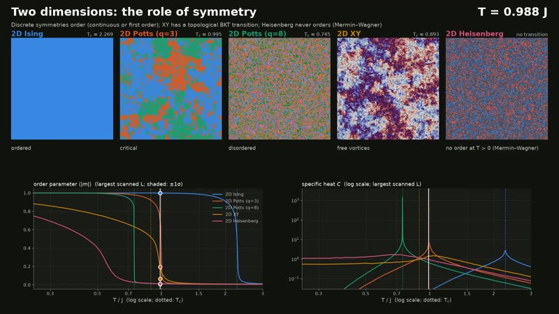</a><br><b>2D: Ising, Potts 3 & 8, XY, Heisenberg</b></td><td width="33%" valign="top"><a href="https://github.com/EstebanCardenas2001/Ising-model/releases/download/v0.2.0/compare_continuous_symmetry.mp4">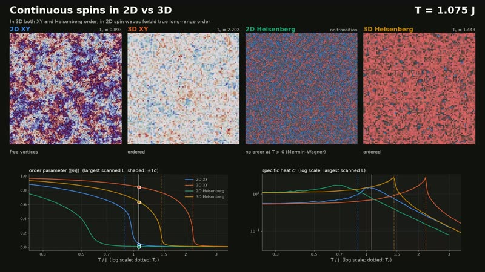</a><br><b>XY and Heisenberg, 2D vs 3D</b></td></tr>
</table>

### Sixteen temperatures at once (30 s each)

Sixteen replicas from 0.8 T<sub>c</sub> to 1.2 T<sub>c</sub>, each starting in equilibrium and then evolving under local
(single-spin) dynamics. Far from T<sub>c</sub> they relax quickly. Near T<sub>c</sub>, domains of all sizes form and relax
slowly (critical slowing down). In the 8-state Potts model, ordered and disordered phases coexist instead.

<p align="center">
  <a href="https://github.com/EstebanCardenas2001/Ising-model/releases/download/v0.2.0/mosaic_ising2d.mp4">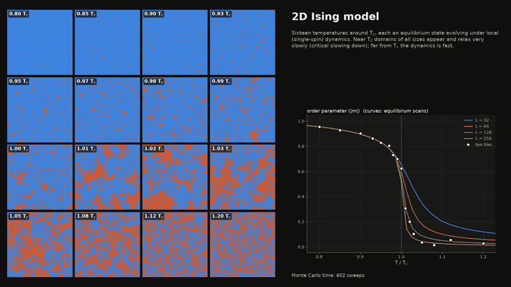</a>
</p>

<table>
<tr><td width="33%" valign="top"><a href="https://github.com/EstebanCardenas2001/Ising-model/releases/download/v0.2.0/mosaic_ising2d.mp4">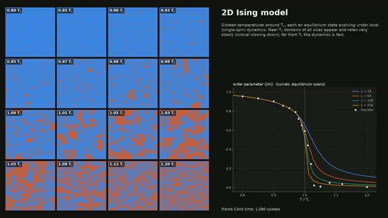</a><br><b>2D Ising</b></td><td width="33%" valign="top"><a href="https://github.com/EstebanCardenas2001/Ising-model/releases/download/v0.2.0/mosaic_ising3d.mp4">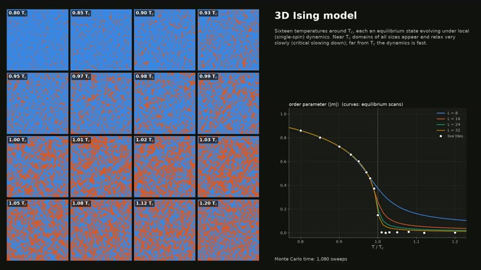</a><br><b>3D Ising</b></td><td width="33%" valign="top"><a href="https://github.com/EstebanCardenas2001/Ising-model/releases/download/v0.2.0/mosaic_potts3_2d.mp4">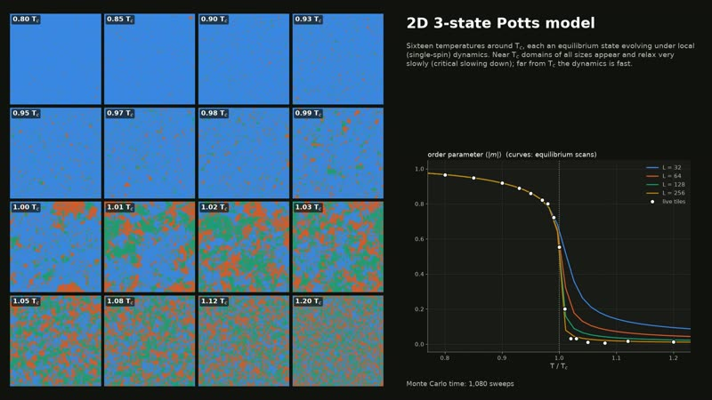</a><br><b>2D 3-state Potts</b></td></tr>
<tr><td width="33%" valign="top"><a href="https://github.com/EstebanCardenas2001/Ising-model/releases/download/v0.2.0/mosaic_potts8_2d.mp4">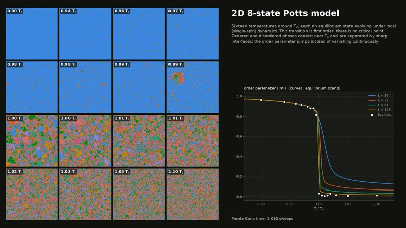</a><br><b>2D 8-state Potts (coexistence)</b></td><td width="33%" valign="top"><a href="https://github.com/EstebanCardenas2001/Ising-model/releases/download/v0.2.0/mosaic_xy2d.mp4">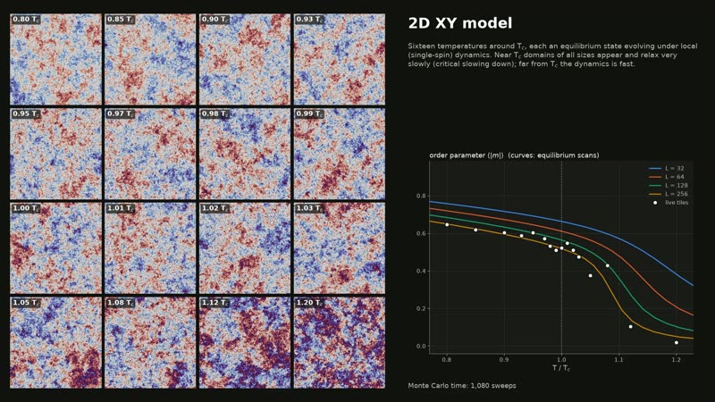</a><br><b>2D XY</b></td><td width="33%" valign="top"><a href="https://github.com/EstebanCardenas2001/Ising-model/releases/download/v0.2.0/mosaic_xy3d.mp4">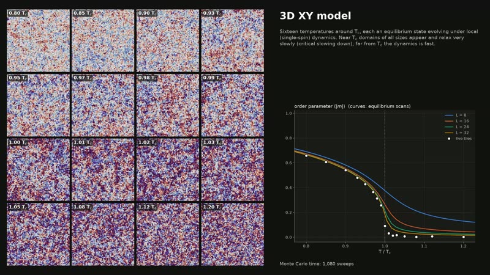</a><br><b>3D XY</b></td></tr>
<tr><td width="33%" valign="top"><a href="https://github.com/EstebanCardenas2001/Ising-model/releases/download/v0.2.0/mosaic_heis3d.mp4">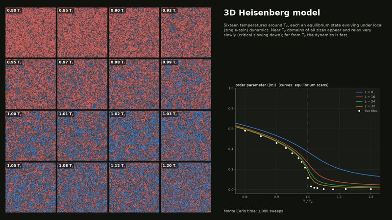</a><br><b>3D Heisenberg</b></td><td></td><td></td></tr>
</table>

## What the simulations show

| System | Transition | Measured here | Reference |
|---|---|---|---|
| 1D Ising | none at T > 0: a domain wall costs only 2J | no order, smooth specific-heat bump | exact |
| 2D Ising | continuous (Onsager) | Binder crossing L=128/256: **T = 2.268** | 2/ln(1+√2) = 2.2692 |
| 3D Ising | continuous | Binder crossing L=24/32 in [4.476, 4.525] | 4.5115 |
| 2D 3-state Potts | continuous | Binder crossing L=64/128 in [0.992, 1.006] | 1/ln(1+√3) = 0.9950 |
| 2D 8-state Potts | **first order** | double-peaked energy histograms, negative U₄, C peak at 0.7445 (L=128) | 1/ln(1+√8) = 0.7449 |
| 2D XY | **BKT** (topological) | stiffness meets 2T/π at 0.923 → 0.906 for L = 32 → 256 (log. convergence) | 0.893 |
| 3D XY | continuous | Binder crossing L=24/32 in [2.188, 2.214] | 2.2018 |
| 2D Heisenberg | none (Mermin–Wagner) | \|m\| on a finite lattice decreases with L at every T | exact |
| 3D Heisenberg | continuous | Binder crossing L=24/32 in [1.434, 1.453] | 1.4430 |

Temperatures are in units of J/k<sub>B</sub>. Each scan uses 64 temperatures and four lattice sizes, with
12 000 measurements per temperature pooled over up to 32 independent parallel-tempering chains.
Finite-size-scaling plots for every system are in [`docs/figures/`](docs/figures).

<p align="center">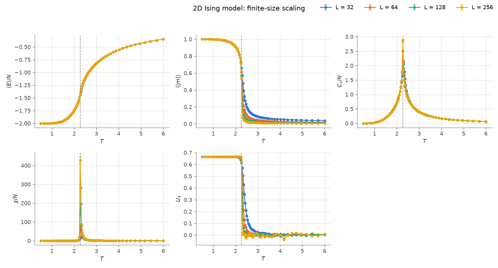</p>

## Critical exponents

`python -m spinmodels.critical <system>` measures the critical exponents by **finite-size scaling**.

1. **Sampling.** For each lattice size L, the GPU simulates hundreds of independent chains at one
   temperature near T<sub>c</sub> in a single batch: up to 512 chains × 10 000 samples, with Swendsen–Wang +
   local updates.
2. **Reweighting.** Single-histogram reweighting (Ferrenberg–Swendsen) turns the samples into
   continuous curves in T, so peaks are located precisely. Errors come from a jackknife over the
   independent chains.
3. **Fits.** The finite-size-scaling laws give the exponents:
   - $\max_T\, d\ln\langle|m|\rangle/d\beta \sim L^{1/\nu}$
   - $\chi_{\max} \sim L^{\gamma/\nu}$
   - $\langle|m|\rangle_{T_c} \sim L^{-\beta/\nu}$

   From these follow $\eta = 2-\gamma/\nu$, $\delta$, and $\alpha = 2 - d\nu$ via hyperscaling.
   The relation $2\beta/\nu + \gamma/\nu = d$ is reported as a consistency check. T<sub>c</sub> comes
   from Binder-cumulant crossings and from extrapolating the peak positions.
4. **Corrections to scaling.** Small lattices bias pure power laws, especially in 3D. Each fit is
   repeated with the leading correction $A L^{x}(1 + B L^{-\omega})$, with $\omega$ fixed to its
   literature value. The correction must stay smaller than the leading term, so the two terms can't
   swap roles.

Results with the corrected fits (sizes 16–256 in 2D, 8–48 in 3D; about 2–7 GPU-minutes per system on a T4):

| System | ν | γ | β | η | δ | T<sub>c</sub> (Binder, largest pair) |
|---|---|---|---|---|---|---|
| 2D Ising | 0.995(8) · *1* | 1.746(14) · *7/4* | 0.124(1) · *1/8* | 0.245(2) · *1/4* | 15.3(1) · *15* | 2.26909(7) · *2.26919* |
| 3D Ising | 0.633(3) · *0.6300* | 1.241(6) · *1.2371* | 0.330(3) · *0.3264* | 0.040(5) · *0.0363* | 4.77(3) · *4.790* | 4.51148(14) · *4.5115* |
| 2D 3-state Potts | 0.828(6) · *5/6* | 1.438(10) · *13/9* | 0.110(2) · *1/9* | 0.263(5) · *4/15* | 14.2(3) · *14* | 0.99497(2) · *0.99497* |
| 3D XY | 0.671(6) · *0.6717* | 1.316(13) · *1.3178* | 0.350(4) · *0.3486* | 0.039(8) · *0.0381* | 4.77(5) · *4.780* | 2.20156(12) · *2.2018* |
| 3D Heisenberg † | 0.699(6) · *0.7112* | 1.394(13) · *1.3960* | 0.359(3) · *0.3689* | 0.005(6) · *0.0375* | 4.97(4) · *4.783* | 1.44257(9) · *1.4430* |

Measured value with its uncertainty in the last digits, followed by the exact or best literature
value in italics. † Pure power-law fits: for Heisenberg the peak heights are about 3× noisier, which
leaves the three-parameter corrected fit unconstrained. It needs larger lattices or more samples, and
its estimates are 1–3% low. Without corrections, all 3D systems show the expected drift (for example
3D Ising ν = 0.619, which rises toward 0.63 as small sizes are dropped). Full tables:
[`docs/critical/`](docs/critical).

<p align="center">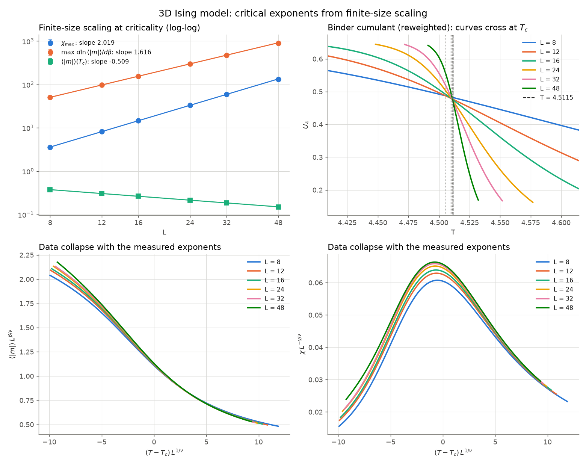<br>
<em>3D Ising. Top: power-law scaling and Binder crossings at T<sub>c</sub>. Bottom: data collapse with the
measured exponents. The small remaining spread for L = 8–12 is the correction to scaling.</em></p>

```bash
python -m spinmodels.critical ising3d                      # GPU, default sizes 8..48
python -m spinmodels.critical ising2d -L 16 32 64 128 --measure 20000
python -m spinmodels.critical xy3d --reuse --L-min 12      # re-analyse saved samples without small sizes
python -m spinmodels.critical potts3_2d --cpu -L 8 12 16 24  # CPU engine (multi-process)
```

```python
from spinmodels.critical import analyze, KNOWN_EXPONENTS, CORRECTION_OMEGA
from spinmodels.gpu.critical import collect_gpu

data = [collect_gpu("ising", L, 3, 4.5115) for L in (8, 12, 16, 24, 32)]
res = analyze(data, Tc=4.5115, omega=CORRECTION_OMEGA["ising3d"], reference=KNOWN_EXPONENTS["ising3d"])
print(res.table())
res.exponents_corrected["nu"]       # (value, error)
```

## Models

| Model | Spins | Known transition |
|---|---|---|
| `IsingModel` | $s_i = \pm 1$ | 2D: $T_c = 2/\ln(1+\sqrt2) \approx 2.269$ (Onsager); 3D: $T_c \approx 4.5115$ |
| `PottsModel` | $s_i \in \{0,\dots,q-1\}$ | 2D: $T_c = 1/\ln(1+\sqrt q)$, continuous for $q\le4$, first order for $q>4$ |
| `XYModel` | unit vectors in $\mathbb R^2$ | 2D: BKT transition, $T_{BKT} \approx 0.893$; 3D: $T_c \approx 2.202$ |
| `HeisenbergModel` | unit vectors in $\mathbb R^3$ | 2D: none (Mermin–Wagner); 3D: $T_c \approx 1.443$ |

All models live on periodic hypercubic lattices of any dimension, with coupling $J$ and field $h$ ($k_B = 1$):

$$
H_\text{Ising} = -J\sum_{\langle ij\rangle} s_i s_j - h\sum_i s_i,\qquad
H_\text{Potts} = -J\sum_{\langle ij\rangle} \delta_{s_i s_j} - h\sum_i \delta_{s_i,0},\qquad
H_{O(n)} = -J\sum_{\langle ij\rangle} \mathbf S_i\cdot\mathbf S_j - h\sum_i S_i^x .
$$

## Install

```bash
uv venv && uv pip install -e ".[dev]"        # CPU only
uv pip install -e ".[dev,gpu]"               # + CUDA engine and videos (CuPy, NVIDIA GPU)
pytest                                        # ~30 s, validates against exact results (GPU tests skip without CUDA)
```

Videos additionally need `ffmpeg` (NVENC hardware encoding is used when available).

## Quick start

```python
import numpy as np
from spinmodels import IsingModel, temperature_scan
from spinmodels.plotting import plot_scan

results = [
    temperature_scan(IsingModel(L, dim=2, seed=L), np.linspace(1.8, 2.8, 21),
                     n_equil=500, n_measure=5000, algorithm="wolff")
    for L in (8, 16, 32)
]
fig, _ = plot_scan(results, Tc=IsingModel.critical_temperature(2))
```

Or from the command line:

```bash
python -m spinmodels ising --dim 3 -L 6 8 12 --tmin 4.2 --tmax 4.8 --nt 13 --algorithm wolff --out output/ising3d
python -m spinmodels potts -q 3 -L 16 32 --tmin 0.9 --tmax 1.1 --algorithm wolff --out output/potts3
python -m spinmodels heisenberg -L 8 12 --tmin 1.3 --tmax 1.6 --algorithm wolff --out output/heis
```

Parallel CPU scan (independent chains, one process per temperature) and CPU parallel tempering:

```python
from spinmodels import IsingModel, PottsModel, parallel_tempering, temperature_scan

res = temperature_scan(IsingModel(32, seed=0), np.linspace(2.0, 2.6, 16),
                       algorithm="swendsen_wang", n_workers=-1)      # all cores
pt = parallel_tempering(PottsModel(24, q=8, seed=0), np.linspace(0.70, 0.80, 12))
pt.extras["swap_acceptance"]
```

GPU scan: every temperature × several independent chains are replicas of one batched CUDA simulation,
updated by Swendsen–Wang + local sweeps and coupled by parallel tempering:

```python
from spinmodels.gpu.scan import gpu_temperature_scan

res = gpu_temperature_scan("ising", L=256, dim=2, temperatures=np.linspace(2.1, 2.45, 64),
                           n_equil=1000, n_measure=10000, n_chains=2)
res.mean["binder"], res.error["binder"], res.extras["swap_acceptance"]
```

Low-level use (one Markov chain):

```python
from spinmodels import XYModel, run, thermodynamics

model = XYModel(32, seed=0)
ts = run(model, T=0.9, n_equil=1000, n_measure=10000, algorithm="metropolis")
obs = thermodynamics(ts.energy, ts.magnetization, T=0.9, N=model.N)  # {name: (value, error)}
tau_e, tau_m = ts.tau()                                               # autocorrelation times
```

## Examples

| Script | Output |
|---|---|
| `examples/ising2d_finite_size.py` | All observables for L = 8, 16, 32. The Binder cumulants cross at the exact $T_c$. |
| `examples/snapshots.py` | Configurations of all four models at 0.6, 1.0, 1.6 $T_c$. |
| `examples/critical_slowing_down.py` | $\tau_\text{int}(L)$ at $T_c$: Metropolis grows with $z\approx2$, while Wolff stays nearly flat. |

Figures go to `output/` (git-ignored).

## Observables

From time series of $e = E/N$ and $m = |\mathbf M|/N$:

| Observable | Estimator |
|---|---|
| Energy | $\langle e\rangle$ |
| Magnetization | $\langle m\rangle$ |
| Specific heat | $C_v/N = N\beta^2(\langle e^2\rangle - \langle e\rangle^2)$ |
| Susceptibility | $\chi/N = N\beta(\langle m^2\rangle - \langle m\rangle^2)$ |
| Binder cumulant | $U_4 = 1 - \langle m^4\rangle / 3\langle m^2\rangle^2$ |

Errors come from a blocked jackknife. Integrated autocorrelation times use Sokal's
automatic windowing. Use `measure_every` or more blocks if $\tau_\text{int}$ is not much smaller
than the block length. For an $n$-component order parameter, $U_4 \to 2/3$ when ordered and
$\to 1-(n+2)/3n$ when disordered (0 for Ising, 1/3 for XY and the Potts vector order parameter,
4/9 for Heisenberg).

## Architecture

```
src/spinmodels/
├── lattice.py        HypercubicLattice: flat (N, 2·dim) neighbor table → kernels are dimension-agnostic
├── models/           CPU models (Numba): base.py (ABC, sweep dispatch), ising.py, potts.py,
│                     vector.py (XY, Heisenberg), _cluster.py (union-find for Swendsen–Wang)
├── observables.py    estimators, jackknife, autocorrelation time
├── simulation.py     run(), temperature_scan() (serial / multi-process), parallel_tempering(), ScanResult
├── critical.py       finite-size scaling: reweighting, peak finding, power-law fits, exponents, plots, CLI
├── plotting.py       plot_scan(), plot_configuration()
├── gpu/              CUDA engine: kernels.cu, engine.py (GPUIsing/GPUPotts/GPUXY/GPUHeisenberg),
│                     scan.py (batched scans + parallel tempering), critical.py (FSS sampling)
├── video/            catalog.py (systems + physics captions), produce.py (GPU frames),
│                     render.py (Matplotlib + ffmpeg/NVENC), pipeline.py (orchestration)
└── __main__.py       CLI
```

**Update algorithms are plug-ins.** `model.sweep(T, algorithm="name")` dispatches to the
method `_name_sweep(beta)`, and `model.algorithms()` discovers these methods automatically. A new
algorithm is therefore one new method on a model; the driver code doesn't change.

| Algorithm | CPU (Numba) | GPU (CUDA) | Notes |
|---|---|---|---|
| Metropolis | `metropolis`: random-site | `metropolis`: checkerboard, O(n) only | vector proposal $\mathrm{normalize}(\mathbf S+\delta\mathbf g)$, $\delta$ tuned to 50% acceptance during equilibration |
| Heat bath | | `heatbath` (Ising, Potts) | exact conditional sampling; `"local"` picks heat bath or Metropolis per model |
| Wolff | `wolff` | | single cluster; spin flip / Potts relabel / O(n) reflection |
| Swendsen–Wang | `swendsen_wang` | `swendsen_wang` | all clusters at once; GPU labelling by parallel union-find (atomicMin hooking) |
| Parallel tempering | `parallel_tempering()` | `gpu_temperature_scan()` | replica exchange between neighbouring temperatures |

Cluster updates require $J>0$ and $h=0$. Two subtleties the exact tests caught:

- **Wolff "sweeps"** grow a *fixed* number of clusters, tuned during equilibration to flip
  $\approx N$ spins. Measuring after "as many clusters as needed to flip N spins" size-biases
  the last cluster and skews the averages.
- **Checkerboard Metropolis is not ergodic for discrete spins.** Moves with $\Delta E=0$ are
  accepted deterministically, so in 1D every domain wall moves ballistically and the difference
  between left- and right-movers is conserved (a 27σ energy bias at T = 1). The GPU therefore uses
  heat-bath updates for Ising and Potts. The CPU picks sites at random, which is ergodic.

**GPU engine** (`spinmodels.gpu`): `R` replicas of an `L^dim` lattice (one temperature each) live in one
device array and are updated in a single kernel launch. Neighbours are computed arithmetically, so
the same kernels serve 1D–4D. Random numbers come from a counter-based Philox4x32-10 generator
(no stored RNG state; reproducible), and energies, magnetizations and the XY helicity modulus come
from one fused reduction kernel. On a Tesla T4: 6–14 G site-updates/s for local updates and
1–2.4 G/s for Swendsen–Wang.

**Adding a model:** subclass `LatticeModel` and implement `_initial_spins`, `energy`,
`magnetization_vector` and `_metropolis_sweep`. Everything else (driver, observables,
error analysis, CLI via the `MODELS` registry) works unchanged.

## Making the videos

```bash
python -m spinmodels.video --preset full          # GPU scans (~1 h on a T4) + all 19 videos (~20 min)
python -m spinmodels.video --preset quick         # small, fast end-to-end check
python -m spinmodels.video --preset full --skip-scans --only ising2d mosaic_xy2d
python -m spinmodels.video --list
```

Output goes to `output/<preset>/`: `videos/*.mp4`, `figures/scan_*.png` and `data/scan_*.npz` (cached scans).

How it works:
- **Equilibrium scans.** The GPU runs every system with all temperatures × several chains as one
  batched simulation (Swendsen–Wang + local updates, parallel tempering).
- **Frames.** For each video, the GPU runs the displayed simulations and streams frame chunks to RAM
  disk. CPU worker processes draw them with Matplotlib, NVENC encodes the segments, and they are
  concatenated losslessly.
- **Gauge fixing.** Lattice images are shown relative to the current order-parameter direction, so
  global flips and rotations from cluster updates don't recolour the whole picture.
- **Smooth histograms.** Energy histograms use single-histogram Ferrenberg–Swendsen reweighting from
  the nearest scan temperature, so they change smoothly with the cursor.

## Validation (`tests/`)

- 3×3 Ising (two temperatures) and q = 3 Potts: all five observables vs **exact enumeration**
  over every state ($2^9$ and $3^9$), for Metropolis, Wolff, Swendsen–Wang and parallel tempering.
- 1D chains vs **closed-form solutions**: Ising $e = -(t + t^{L-1})/(1+t^L)$, XY
  $e = -I_1(K)/I_0(K)$, Heisenberg $e = -(\coth K - 1/K)$, for every CPU algorithm. Multi-process
  scans are checked the same way.
- **GPU**: Ising, q-state Potts ($Z=\lambda_1^L+(q-1)\lambda_2^L$), XY and Heisenberg chains plus
  4×4 Ising enumeration, for local and Swendsen–Wang updates. The parallel-tempering scan reproduces
  the universal Binder cumulant $U^*\approx0.611$ at $T_c$, and the XY helicity modulus has the
  spin-wave limit $\Upsilon\approx J-T/4$.
- Metropolis vs Wolff agreement for 2D XY and 3D Heisenberg, plus the Potts(q=2) ↔ Ising mapping,
  the estimators on synthetic AR(1) data, lattice geometry, spin normalization and seeding.

## Notes

- Numba draws from one global RNG stream. Every model re-seeds it on construction, so
  `seed=` makes a single run reproducible. For parallel runs, use separate processes.
- `temperature_scan(anneal=True)` (the default) visits temperatures from hot to cold and reuses
  the configuration between points.
- Kernels are compiled with `cache=True`, so only the very first run pays the compilation time.
